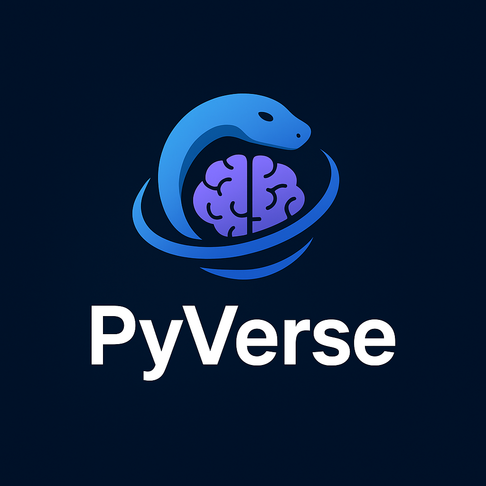

# Business-Scraper

<p align="center">
  <strong>A modular desktop and CLI platform for collecting, organizing, and exporting business listings.</strong>
</p>

<p align="center">
  
</p>

<p align="center">
  <em>Built with Python · Playwright · PySide6 · SQLAlchemy</em>
</p>

Business-Scraper is a Python application for running business-data collection jobs from supported map sources, keeping results in a local database, reviewing run history, and exporting collected records. It provides both a desktop GUI and a command-line interface, with a source-adapter architecture intended to keep source-specific extraction separate from the shared processing pipeline.

> **Project status:** Active development. Google Maps and Neshan are the currently integrated sources. Exact capabilities depend on the adapter and access mode implemented for each source.

## Contents

- [Highlights](#highlights)
- [Supported sources](#supported-sources)
- [Architecture](#architecture)
- [Technology stack](#technology-stack)
- [Requirements](#requirements)
- [Installation](#installation)
- [Running the desktop application](#running-the-desktop-application)
- [Command-line usage](#command-line-usage)
- [Data storage and exports](#data-storage-and-exports)
- [Configuration](#configuration)
- [Testing](#testing)
- [Project layout](#project-layout)
- [Design principles](#design-principles)
- [Limitations and responsible use](#limitations-and-responsible-use)
- [Development workflow](#development-workflow)

## Highlights

- **Multiple interfaces:** run jobs through a PySide6 desktop application or CLI.
- **Source adapters:** Google Maps and Neshan are integrated behind a shared application and scraping workflow.
- **Multi-keyword requests:** run a search for several business categories in one request.
- **Shared processing pipeline:** clean and normalize extracted data before persistence.
- **Deduplication:** reduce duplicate business records across collection runs.
- **Local persistence:** store businesses and run metadata in SQLite through SQLAlchemy.
- **Run traceability:** associate discovered businesses with their scrape runs and inspect previous runs.
- **Export options:** export all businesses or the businesses associated with a specific run to CSV, JSON, or Excel.
- **Excel summaries:** run-based Excel exports include a separate scrape-summary worksheet.
- **Desktop dashboard:** inspect recent runs, browse results, configure settings, and access license controls.
- **Operational resilience:** retry support, error handling, and browser lifecycle management.
- **Regression tests:** a pytest suite covers key application, scraping, persistence, CLI, and export behavior.

## Supported sources

| Source | Integration | Notes |
| --- | --- | --- |
| Google Maps | Integrated | Web-based collection through Playwright is available. |
| Neshan | Integrated | Source-specific configuration may be required, including an API key for API-backed access. |

The source and access mode are separate concepts in the application design. Availability is adapter-specific; do not assume every source supports every access mode.

## Architecture

The application separates the user interfaces, orchestration, source-specific extraction, shared data processing, persistence, and export functionality.

```text
Desktop GUI / CLI
       |
       v
Application composition
       |
       v
Scrape request and pipeline
       |
       v
Source selection (factory / registry)
       |
       v
Source adapter and access implementation
       |
       v
Extraction -> Cleaning -> Deduplication
       |
       v
SQLite / SQLAlchemy
       |
       +----> Run history and business lookup
       |
       +----> Export service -> CSV / JSON / Excel
```

### Main responsibilities

- **Interfaces:** desktop pages and command-line argument handling.
- **Application layer:** composes dependencies and coordinates use cases.
- **Core pipeline:** runs scrape requests, handles keyword-level progress and errors, and records run outcomes.
- **Scrapers:** source-specific search and extraction logic.
- **Browser management:** manages Playwright browser resources for web collection.
- **Cleaning and deduplication:** normalize extracted values and identify existing businesses.
- **Database:** persist business records and scrape-run relationships.
- **Exporters and services:** retrieve data and write supported output formats.

## Technology stack

| Component | Technology |
| --- | --- |
| Language | Python |
| Desktop GUI | PySide6 |
| Browser automation | Playwright with Chromium |
| Persistence | SQLite |
| ORM | SQLAlchemy |
| Excel output | openpyxl |
| Tests | pytest |
| Packaging support | PyInstaller |

## Requirements

- Python 3.12 or newer
- Git
- Dependencies listed in `requirements.txt`
- Chromium installed for Playwright when using browser-based collection

## Installation

Clone the repository and enter its directory:

```bash
git clone https://github.com/AliValizade/Business-Scraper.git
cd Business-Scraper
```

Create and activate a virtual environment.

**Windows (PowerShell):**

```powershell
py -3.12 -m venv .venv
.\.venv\Scripts\Activate.ps1
```

**Windows (Git Bash) or Linux/macOS:**

```bash
python -m venv .venv
source .venv/Scripts/activate  # Windows Git Bash
# On Linux/macOS, use: source .venv/bin/activate
```

Install dependencies and the Playwright Chromium browser:

```bash
python -m pip install --upgrade pip
pip install -r requirements.txt
playwright install chromium
```

## Running the desktop application

Start the desktop application from the repository root:

```bash
python desktop.py
```

The interface provides:

- Dashboard metrics and recent runs
- A scrape form for choosing a source, location, keywords, and result limit
- Progress feedback and run status
- Run history and run inspection
- Business results browsing
- CSV, JSON, and Excel export workflows
- Settings and license pages

## Command-line usage

All commands below are run from the repository root.

### Scrape businesses

A basic Google Maps search:

```bash
python main.py scrape --source google_maps --location "مشهد" --keyword "فست فود" --max-results 30
```

Use multiple keywords in a single request:

```bash
python main.py scrape \
  --source google_maps \
  --location "مشهد" \
  --keyword "فست فود" \
  --keyword "رستوران" \
  --max-results 50
```

The result limit applies to the entire request. Omit `--max-results` when you do not want to set an explicit cap.

For another integrated source, pass its source identifier, for example:

```bash
python main.py scrape --source neshan --location "تهران" --keyword "رستوران" --max-results 30
```

Source-specific requirements, such as API credentials, must be configured for the selected adapter.

### List recent runs

```bash
python main.py runs
python main.py runs --limit 10
```

### Inspect a run

Display run details:

```bash
python main.py run 1
```

Display the businesses associated with that run:

```bash
python main.py run 1 --businesses
```

Replace `1` with the ID of the run you want to inspect.

### Export data

Export all stored businesses:

```bash
python main.py export --format csv --output exports/businesses.csv
python main.py export --format json --output exports/businesses.json
python main.py export --format excel --output exports/businesses.xlsx
```

Export only businesses associated with a specific run:

```bash
python main.py export --run-id 1 --format csv --output exports/run-1.csv
python main.py export --run-id 1 --format json --output exports/run-1.json
python main.py export --run-id 1 --format excel --output exports/run-1.xlsx
```

The output directory is not guaranteed to exist automatically; create it before exporting if needed. Run-based Excel exports include the business data and a **Scrape Summary** worksheet.

For the full list of available arguments, use:

```bash
python main.py --help
python main.py scrape --help
python main.py export --help
```

## Data storage and exports

The application initializes its local database when the CLI or desktop application starts. SQLite is intended for local, single-user workflows in the current scope.

Scrape-run records provide operational history, while business records hold the collected data. Run-to-business associations make it possible to inspect or export the results from an individual run.

Supported export formats:

- **CSV** — convenient for spreadsheets and downstream data processing.
- **JSON** — useful for integrations and scripts.
- **Excel** — spreadsheet output, with an additional summary sheet for run-based exports.

Database files, log files, virtual environments, and generated build artifacts are local runtime/development files and should not be committed to the repository.

## Configuration

### Neshan credentials

For API-backed Neshan access, provide the API key through the environment variable used by the application:

**PowerShell:**

```powershell
$env:NESHAN_API_KEY = "your-api-key"
python desktop.py
```

**Windows Command Prompt:**

```bat
set NESHAN_API_KEY=your-api-key
python desktop.py
```

Do not commit API keys, tokens, or other secrets. Use the configuration mechanism supported by the selected interface and source adapter.

### Desktop source selection

The desktop application reads its default source from `BUSINESS_SCRAPER_SOURCE`; if unset, it defaults to `google_maps`.

**PowerShell example:**

```powershell
$env:BUSINESS_SCRAPER_SOURCE = "google_maps"
python desktop.py
```

Review `config.py` and the relevant source adapter before changing browser behavior, timeouts, retry settings, or collection limits.

## Testing

Run the complete test suite from the repository root:

```bash
pytest -q
```

Tests are organized around regression coverage for the application, source adapters, core pipeline, database behavior, CLI, desktop source configuration, run history, and exporters. Run tests after changes to confirm that existing behavior remains intact.

## Project layout

```text
app/                 Application composition and use-case wiring
browser/             Browser lifecycle management
cli/                 CLI parser and command handlers
interfaces/desktop/  PySide6 desktop application and pages
core/                Shared scraping pipeline and orchestration
scrapers/            Source-specific scraping adapters
database/            SQLAlchemy models, sessions, and persistence
services/            Shared application services
exporters/           CSV, JSON, and Excel output
assets/              Desktop application assets
tests/               Automated regression tests
main.py              CLI entry point
desktop.py           Desktop entry point
config.py            Scraper/browser configuration
requirements.txt     Python dependencies
```

## Design principles

- Keep the shared pipeline independent of source-specific page structure and extraction details.
- Add new sources through the adapter/factory/registry abstractions rather than coupling them directly to the core pipeline.
- Keep cleaning and deduplication as shared processing steps.
- Keep persistence and export responsibilities separate from extraction.
- Preserve run traceability so results can be inspected after a collection job.
- Prefer small, testable changes and maintain regression coverage.

## Limitations and responsible use

Business-Scraper is under active development. It is not currently intended to be a hosted multi-user scraping service or a CRM.

The current scope does not include CRM/lead management, AI enrichment, cloud database infrastructure, multi-user access, CAPTCHA solving, access-control circumvention, or advanced proxy rotation.

Use the application responsibly and follow the applicable source website's terms, access rules, privacy requirements, and local laws. Only collect and use data you are authorized to access. The project does not guarantee that a source will remain compatible as its website, API, or access policies change.

## Development workflow

Development is organized into focused feature branches. Changes should be covered by tests and the complete test suite should pass before merging into `main`.

When contributing:

1. Create a focused branch for the change.
2. Keep source-specific logic within the appropriate adapter.
3. Add or update regression tests.
4. Run `pytest -q`.
5. Open a pull request with a concise summary and test results.

---

Maintained by [Ali Valizadeh](https://github.com/AliValizade).

Part of the **PyVerse** ecosystem.
